# Automated triangulation methodology

_Method for source-grounded evaluator calibration without human expert participation_

---

## Purpose and status

This study tests whether a role-separated automated evaluator is sufficiently consistent and construct-sensitive to support experimental Skill development. It does not test agreement with domain experts and does not establish external or publication-level validity.

The previous public-synthetic run is retained as a failed preliminary baseline: it produced excessive primary-judge disagreement and an adjudication rate above its preregistered ceiling. The replacement study starts from new automated-only splits and does not reuse the original expert holdout.

## Data boundaries and splitting

Private source passages, evidence spans, PDFs, extracted text, access records, and source-linked judge packets remain under ignored `research-private/` paths. Tracked artifacts contain schemas, prompts, hashes, sanitized source identifiers, independently written synthetic cases, and aggregate results only.

Each original, paraphrase, and derived contrast remains in one source cluster. Development may be used to repair prompts and anchors. Validation may select only among alternatives specified before its results are examined. Only `silver_high_confidence` private cases may enter validation or holdout. The automated holdout remains unopened until both evaluator and Skill acceptance rules are frozen.

The original expert holdout is separate, unchanged, and unopened.

## Source-grounded workflow

```mermaid
flowchart LR
    accTitle: Automated Triangulation Workflow
    accDescr: Private source context is independently assessed by bounded roles, challenged for applicability, reconciled into confidence-graded silver labels, and evaluated on frozen development, validation, and holdout splits.

    source[Private source context] --> roles[Run isolated roles]
    roles --> challenge[Challenge applicability]
    challenge --> adjudicate[Meta-adjudicate records]
    adjudicate --> silver{Silver confidence sufficient?}
    silver -->|Yes| split[Assign source cluster]
    silver -->|No| unresolved[Retain unresolved]
    split --> develop[Repair on development]
    develop --> validate{Validation passes?}
    validate -->|No| report[Publish failure analysis]
    validate -->|Yes| freeze[Freeze evaluator and hashes]
    freeze --> holdout[Open automated holdout once]

    classDef decision fill:#fef9c3,stroke:#ca8a04,stroke-width:2px,color:#713f12
    classDef success fill:#dcfce7,stroke:#16a34a,stroke-width:2px,color:#14532d
    classDef danger fill:#fee2e2,stroke:#dc2626,stroke-width:2px,color:#7f1d1d

    class silver,validate decision
    class freeze,holdout success
    class unresolved,report danger
```

Context packets reconstruct passage function, actor, decision, timing, information, objective, constraints, mechanism, trade-off, evidence basis, boundaries, contribution, necessary surrounding context, and uncertainty. A source's outlet never determines its label.

## Independent signals

The study combines signals that fail in different ways:

- Synthetic construct recovery with applicability fixed by construction
- One-construct contrast ordering and category localization
- Faithful-paraphrase invariance
- Prestige-label blindness and heading/style perturbations
- Private source-grounded positive recognition
- Original negative-control rejection
- Repeated-run stability
- Evidence-span sufficiency and source-context consistency

Automated model variants are recorded exactly. They are described as same-family variants unless genuine family independence can be demonstrated. Prompt variation, identifier randomization, and fresh contexts reduce shared surface cues but do not create human expertise or statistical independence.

## Scoring and decisions

Applicability is predetermined for synthetic cases. For private cases it is derived from passage function, requested task, supplied context, and attempted layers. A role may return `accept` or `challenge_with_evidence`; unsupported overrides are invalid.

Fidelity is represented by atomic checks rather than one broad hard-failure label. A hard failure requires both materiality and a supporting passage or context evidence span. Ambiguous cases remain `uncertain` and do not silently become passes or failures.

The preregistration fixes category-localization tolerances, unaffected-category tolerances, inter-run variation limits, distribution requirements, evidence requirements, and stop conditions before validation results are inspected. Aggregate success cannot compensate for a failed noncompensatory gate.

## Stop conditions

Stop before evaluator freeze if source-cluster balance is inadequate, validation lacks sufficient `silver_high_confidence` cases, evidence cannot support a material fidelity finding, disagreement remains excessive, localization fails, prestige effects are material, or copyright boundaries are uncertain.

After freeze, open the automated holdout once. Do not tune evaluator or Skill behavior from its case details. If the holdout or production benchmark fails, preserve the result, publish a candid failure analysis, and do not claim experimental superiority or create the experimental release.
