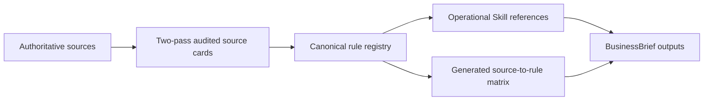

# Literature-Grounded Skill Design

## Architectural constraint

DFC-12 and the six fidelity gates are unchanged. Literature-grounded managerial framing and scholarly positioning begin only after fidelity is eligible. Prose execution is last and cannot compensate for an earlier-layer failure.

This diagram is original to the project. It does not reproduce a publisher figure or visual identity.

## Mandatory order

1. Freeze model invariants.
2. Classify decisions, states, parameters, observations, uncertainty, outcomes, and derived variables.
3. Complete DFC-12.
4. Run actor, timing, information, behavior, constraints, and objective gates.
5. Reject or repair inconsistent scenarios.
6. Apply managerial framing.
7. Apply scholarly positioning when appropriate.
8. Draft the requested text.
9. Audit evidence and boundaries.
10. State the primary remaining weakness.

## Traceability and admission

The manifest is canonical for source metadata; cards are canonical for what was actually reviewed; the registry is canonical for operational rules. Generated documents expose mappings but never create evidence. A `core_triangulated` rule requires two independent authoritative sources, or one Tier A source and one Tier B source. Repetition inside one publication family is not independence. Rules marked `original_framework_rule` are project design choices with no admitted source prescription; they must never be presented as literature consensus.

All 20 v0.2 cards passed separate fresh-context extraction and audit passes. Verification means the card is accurate within its recorded scope; it does not mean that full text was reviewed. The audited corpus admits one triangulated scholarly-positioning rule, one provisional problematization rule, bounded official outlet guidance, and practitioner observations. Other DFC, domain, implication, and introduction rules remain explicitly original.

## Copyright boundary

The design and operational abstractions are original. Source texts, publisher layouts, screenshots, and copied diagrams are not stored. v0.2 ships metadata and original notes only; third-party materials remain under their own copyright and are not covered by the repository's MIT license.
