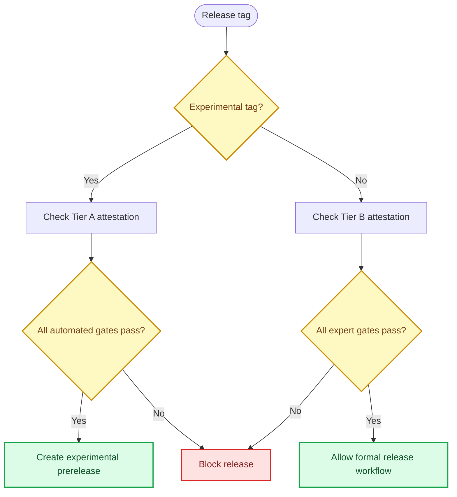

# No-human validation policy

_Governance policy for automated evaluator development and experimental Skill releases_

---

## Policy summary

This project separates automated development authorization from formal validation. Passing an automated study can justify an explicitly experimental Skill revision, but it cannot establish agreement with domain experts, external validity, or publication readiness.

| Authorization | Evidence required | Permitted outcome | Claims that remain prohibited |
| --- | --- | --- | --- |
| **Tier A** | Preregistered, source-grounded, role-separated automated calibration; frozen evaluator; one-time automated holdout; completed production benchmark | Experimental development and a `v0.3.0-experimental.*` prerelease | Expert validation, scholar approval, external criterion validity, publication-level validation, proven superiority |
| **Tier B** | The existing expert-calibration protocol, including qualified human reviewers and its independently locked holdout | Formal validation claims and non-experimental v0.3 release consideration | Any claim not supported by the completed human study |

The tiers are independent. Tier A never satisfies, substitutes for, or weakens Tier B.

## Tier A authorization

Tier A permits experimental changes only when the canonical attestation at `evals/automated-triangulation/results/tier-a-attestation.json` records all of the following:

- Development and validation passed their preregistered automated gates
- The evaluator was frozen before the automated holdout was opened
- The automated holdout was opened once and preserved
- The experimental production benchmark completed
- The original expert holdout remained unopened
- No human experts participated
- The freeze commit is recorded
- `experimental_release_eligible` is `true`

Tier A may authorize response profiles, output-contract revisions, OR-specific framing rules, non-repetition changes, internal-versus-visible reasoning separation, and public experimental evaluation. All outputs and release materials must use the phrase **automated source-grounded triangulation** and identify annotations as silver labels.

## Tier B authorization

Tier B remains governed by the existing private expert attestation at `evals/calibration/public-metadata/private-calibration-attestation.json` and the original expert-validation protocol. A non-experimental v0.3 tag is blocked unless that attestation records real qualified reviewers, a valid evaluator freeze, an opened expert holdout, a completed production benchmark, and `release_eligible: true`.

Automated agents do not count as experts. Outlet prestige, publication status, citation count, or confident automated agreement cannot replace qualified human review.

## Enforcement

CI validates both attestation interfaces and their internal invariants. The release workflow selects exactly one tier from the tag. A failed or incomplete attestation blocks release; it does not downgrade the claim language automatically.

## Current status

At the start of `v0.3.0-experimental.1` development, Tier A has not authorized a release. The earlier public-synthetic calibration failed its preregistered adjudication-rate gate, and its results are diagnostic only. The replacement automated triangulation study must complete development, validation, freeze, holdout, and production evaluation before `experimental_release_eligible` can become `true`.

Tier B remains blocked because no real blinded expert annotations exist. The original expert holdout remains unopened and available for a future formal study.
